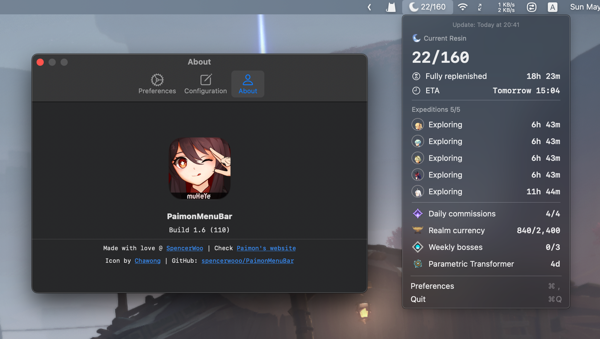

<div align="center">
  
  <h3><code>PaimonMenuBar</code></h3>
  <p><em>Paimon's now in your menu bar!</em></p>

  
  
  <a href="https://github.com/spencerwooo/PaimonMenuBar/releases/latest"></a>
</div>

## Demo

[](https://paimon.swo.moe)

## What's this?

Genshin Impact has got a complicated daily (weekly) system, consisting of:

* 4 Daily commisions.
* 5 Expeditions.
* 3~6 Weekly bosses.
* and most importantly - **Resin** - capped at 160.

Keeping track of these things daily to decide whether it is time to log into Genshin Impact is a pain-in-the-ass. Hence, I present: `PaimonMenuBar`.

`PaimonMenuBar` is a native SwiftUI app living only in your macOS menu bar. Paimon will periodically pulls data from the Mihoyo API to update your latest in-game statistics - so you can decide whether it's time to continue the grind in that stupid artifact domain ;).

## Download

[](https://github.com/spencerwooo/PaimonMenuBar/releases/latest)

## TO-DO

* [x] Menu bar of varying height.
* [x] Configurable data refresh rate.
* [x] Start at login.
* [x] `i18n` support for at least Simplified Chinese and English.
* [x] Manual refresh button.
* [x] Code-sign and publish as `.dmg`.
* [x] Auto-updates and check for update.
* [x] Custom website and help for acquiring the cookie.
* [x] Help button beside the text field for entering the cookie.
* [x] Support for cn and global genshin accounts (米游社 and hoyolab).
* [ ] Better first-time installation experience (guidance for initial setup).
* [ ] Backward-compatibility for macOS 11.0.
* [ ] Support for multiple accounts?

## Releasing a new version

* Create a build in Xcode, bump the build number, and notarize build.
* Create a new release on GitHub with a new version tag and increment the build number.
* Use `create-dmg` to create the `.dmg` file:

  ```bash
  create-dmg PaimonMenuBar.app
  ```

* Update appcast.xml with the new version tag and build number:

  ```bash
  cd <PATH_TO_SPARKLE>/artifacts/sparkle/bin
  ./generate_appcast <PATH_TO_PROJECT>/PaimonMenuBar/Build/

* Profit.

## Credits and related

* Credits to [@Chawong](https://www.pixiv.net/en/artworks/92415888) for the logo - originally posted on Pixiv - where I have shamelessly stolen from. (Love from Hu Tao :heart:).
* Credits to the iOS widget made with Scriptable: [[闲聊杂谈][工具分享] iOS 快捷指令/小组件 树脂查询 自动获取，无需手动输入树脂](https://bbs.nga.cn/read.php?tid=29801567).
* Similar web extension: [daidr/paimon-webext](https://github.com/daidr/paimon-webext).

## License

[MIT](LICENSE)

<div align="center">
  
  <em>made with ❤️ by <a href="https://spencerwoo.com">spencer woo</a></em>
</div>
